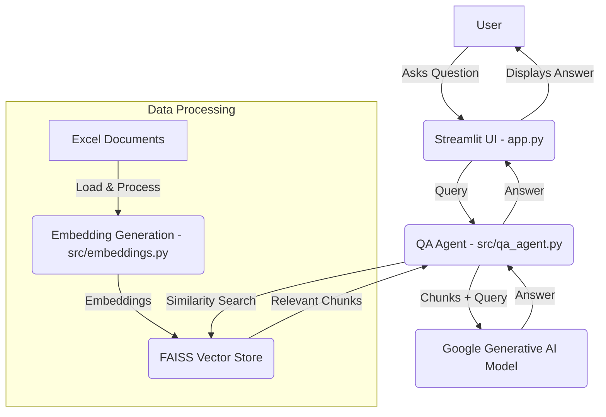

# AI Agent for QA on Shared Documents

This project develops an AI-powered agent capable of answering questions based on shared Excel documents. It integrates natural language processing (NLP) techniques with a user-friendly Streamlit interface.

## Overview

The AI agent leverages Google's Generative AI models for embeddings and question-answering. It uses FAISS for efficient similarity search over pre-processed Excel document content. The Streamlit UI allows users to interact with the agent by inputting questions and viewing generated answers.

## System Architecture

The system consists of three main components:

1.  **Embedding Generation (`src/embeddings.py`)**:
    *   Utilizes `Polars` for fast Excel file loading and processing, handling large files efficiently with streaming and caching.
    *   Splits document content into manageable chunks using `RecursiveCharacterTextSplitter`.
    *   Generates embeddings for these chunks using `GoogleGenerativeAIEmbeddings`.
    *   Stores the embeddings in a FAISS vector store for rapid similarity search.

2.  **Question Answering (QA) Agent (`src/qa_agent.py`)**:
    *   Loads the pre-existing FAISS vector store.
    *   Initializes a `ChatGoogleGenerativeAI` model (gemini-pro) for generating answers.
    *   Sets up a `create_retriever_tool` to allow the agent to search the FAISS vector store.
    *   Implements a LangGraph ReAct agent using `create_react_agent` that leverages the retriever tool to answer questions.
    *   The agent processes user queries by deciding whether to use the retriever tool to fetch relevant document chunks and then synthesizing an answer based on the retrieved information.

3.  **User Interface (UI) (`app.py`)**:
    *   Built with `Streamlit` for a simple and intuitive user experience.
    *   Provides a text input field for users to type their questions.
    *   Displays the answers generated by the AI agent.
    *   Includes a sidebar with information about the application, the status of the document embeddings, and sections for uploading new documents and re-creating embeddings.
    *   Allows users to upload new Excel, PDF, and Word documents, which are then processed and used to update the FAISS index.
    *   Provides options to re-create embeddings for either the uploaded documents or the default pre-existing documents.



## Setup and Installation

1.  **Clone the repository (if applicable):**
    ```bash
    # Assuming you are in the parent directory where you want to clone
    git clone <your-repository-url>
    cd <your-repository-name>
    ```

2.  **Create a virtual environment (recommended):**
    ```bash
    python -m venv venv
    # On Windows
    .\venv\Scripts\activate
    # On macOS/Linux
    source venv/bin/activate
    ```

3.  **Install dependencies:**
    ```bash
    pip install -r requirements.txt
    ```
    *(Note: You will need to create a `requirements.txt` file if it doesn't exist. See "Creating requirements.txt" below.)*

4.  **Set up Google API Key:**
    *   Obtain a Google API Key from the [Google AI Studio](https://aistudio.google.com/app/apikey).
    *   Create a `.env` file in the root directory of the project.
    *   Add your API key to the `.env` file:
        ```
        GOOGLE_API_KEY="YOUR_API_KEY_HERE"
        ```

5.  **Ensure Embeddings are Created:**
    *   The project expects the `faiss_excel_index` directory to exist with pre-computed embeddings for `data.xlsx` and `Forcast.xlsx`.
    *   If this directory is missing or corrupted, the Streamlit app provides a "Re-create Embeddings" button in the sidebar. Alternatively, you can run the `embeddings.py` script directly:
        ```bash
        python src/embeddings.py
        ```

## Creating `requirements.txt`

If `requirements.txt` does not exist, create it with the following content:

```
streamlit
langchain
langchain-google-genai
polars
python-dotenv
faiss-cpu
openpyxl
langgraph
pypdf
python-docx
```

## Running the Application

Once setup is complete, run the Streamlit application from the project root directory:

```bash
streamlit run app.py
```

This will open the application in your web browser.

## Usage

1.  **Check Document Status**: The sidebar will indicate if the FAISS Vector Store is loaded successfully.
2.  **Enter Question**: Type your question related to the Excel documents in the text area.
3.  **Get Answer**: Click the "Get Answer" button to receive the AI-generated response.
4.  **Re-create Embeddings**: If the vector store fails to load, use the "Re-create Embeddings" button in the sidebar to generate them.

## Code Walkthrough

### `src/embeddings.py`

This script handles the loading, processing, chunking, and embedding of various document types, then stores them in a FAISS index.

*   **`DocumentEmbeddings` Class**:
    *   `load_excel_with_polars(file_path, sheet_name=None)`: Efficiently loads Excel files using Polars, processes each sheet, cleans empty rows/columns, and converts DataFrame content to text.
    *   `polars_df_to_text(df, sheet_name)`: Converts a Polars DataFrame into a structured text format.
    *   `load_pdf(file_path)`: Loads PDF files using `PyPDFLoader`.
    *   `load_docx(file_path)`: Loads DOCX files using `Docx2txtLoader`.
    *   `load_document(file_path)`: A generic loader that dispatches to the appropriate specific loader based on file extension (`.xlsx`, `.pdf`, `.docx`).
    *   `process_large_excel_streaming(file_path, chunk_rows=50000)`: Handles very large Excel files by processing them in chunks.
    *   `process_file_with_cache(file_path, use_streaming=False, chunk_rows=50000)`: Manages caching of processed document chunks.
    *   `create_embeddings_parallel(all_chunks, batch_size=100, max_workers=3)`: Generates embeddings for document chunks in parallel.
    *   `create_and_store_embeddings_optimized(files_to_embed, ...)`: The main orchestration function that combines document loading, caching, streaming (for Excel), and parallel embedding creation to build and save the FAISS index.
*   **`create_and_store_embeddings(files_to_embed: list = None)`**: Main entry point to trigger the embedding process. It now accepts an optional list of `files_to_embed` (Excel, PDF, Word). If None, it defaults to the pre-defined Excel files.
*   **`load_existing_vector_store()`**: Utility function to load the FAISS index.

### `src/qa_agent.py`

This script defines the core AI agent responsible for question answering.

*   **`QAAgent` Class**:
    *   `__init__(self, faiss_index_path="faiss_excel_index")`: Initializes the agent, loading the LLM, vector store, and setting up the agent.
    *   `_initialize_llm()`: Sets up the `ChatGoogleGenerativeAI` model.
    *   `_load_vector_store()`: Loads the FAISS index using `GoogleGenerativeAIEmbeddings` and creates a `create_retriever_tool` from it.
    *   `_setup_agent()`: Configures the LangGraph ReAct agent using `create_react_agent` with the LLM and the retriever tool.
    *   `ask_question(self, query: str)`: The main method to answer a user's question. It invokes the LangGraph ReAct agent with the user's query, which then uses the retriever tool to fetch relevant documents and generates an answer.

### `app.py`

This is the Streamlit application file that provides the user interface.

*   **`get_qa_agent()`**: A cached function that initializes the `QAAgent` to prevent re-initialization on every Streamlit rerun, improving performance. It also handles error reporting for API key or FAISS loading issues.
*   **Streamlit UI Elements**:
    *   `st.set_page_config`, `st.title`, `st.markdown`: Sets up the page layout and title.
    *   `st.sidebar`: Contains information about the app, document status, and sections for uploading new documents and re-creating embeddings.
    *   `st.file_uploader`: Allows users to upload Excel, PDF, and Word documents.
    *   `st.text_area`, `st.button`: Provides the input field for questions and the trigger for getting answers.
    *   `st.spinner`: Shows a loading indicator while processing questions or creating embeddings.
    *   Error and success messages are displayed using `st.error`, `st.warning`, and `st.success`.

## Challenges and Solutions

*   **Large Excel File Processing**: Initial attempts with Pandas were slow and memory-intensive for large Excel files. Switched to `Polars` for significantly faster and more memory-efficient data loading and processing, including streaming capabilities for very large files.
*   **Embedding Generation Speed**: Generating embeddings for many chunks can be time-consuming. Implemented parallel processing using `ThreadPoolExecutor` to create embeddings in batches, significantly reducing the overall processing time while managing API rate limits with small delays.
*   **FAISS Deserialization Warning**: The `allow_dangerous_deserialization=True` flag was added to `FAISS.load_local` to address a warning related to loading pickled objects, which is necessary for the current setup.
*   **Streamlit State Management**: Used `@st.cache_resource` for the `get_qa_agent` function to ensure the QA agent (and thus the LLM and vector store) is initialized only once, improving application responsiveness. `st.experimental_rerun()` is used after re-creating embeddings to force the Streamlit app to reload and pick up the new FAISS index.
